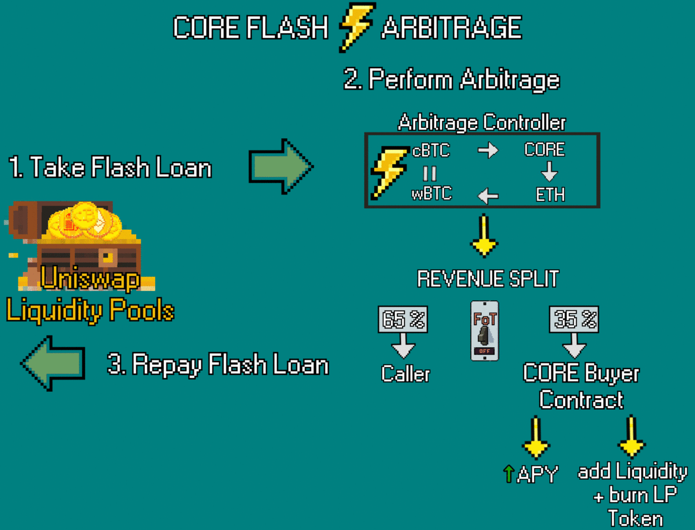

# CORE Router


_Warning! The CORE Router was released for the first version of CORE. Currently it is under active development and it is not recommended to interact with the Router contracts. Stay up to date with dev changes by following the official Twitter & Medium accounts._


<figure><figcaption></figcaption></figure>

The CORE Router is a set of contracts that allow you to connect your liquidity into the internet of the CORE Ecosystem. There are four intended functions of the router: zapper, swapper, wrapper, & flash arbitrage.

The zapper converts your ETH into LP tokens which was mainly used for the first version of CORE but worth mentioning because it also prevented being front run by liquidity bots. The swap system was never released but intended to be easy swaps between different tokens. The wrapper allows you to wrap to and from ERC-95, so wBTC into cBTC. This function was used to migrate V1 CORE LPs into coreDAO vouchers. The flash arbitrage suite deserves its own section and is the most complex out of all the router functions.

<figure><figcaption></figcaption></figure>
