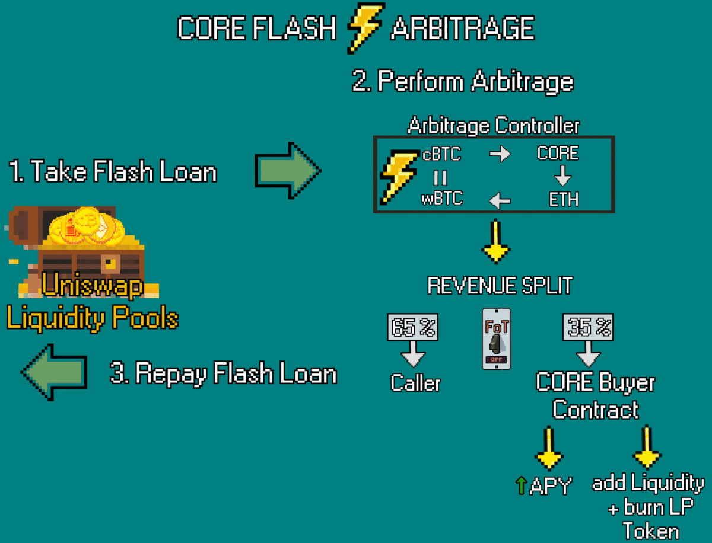

# CORE Flash Arbitrage

<figure><figcaption></figcaption></figure>

CORE Flash Arbitrage consists of two principles:

* **Arbitrage**
* **Flash Swaps**

### What is Arbitrage? 

Arbitrage refers to the low risk opportunity to profit from price discrepancies of assets in different markets. If one asset is traded in two or more markets anyone can profit if assets are traded at different prices. Furthermore, this process can be automated with trading systems that rely on algorithms that can spot these price discrepancy before the market can react.

### What is a Flash Swap? 

Flash swaps allows users to take out a loan from any liquidity pool without any cost with the condition that the collateral is returned at the end of the transaction. If you are unable to meet these conditions the flash swap transaction will be canceled.

Flash Swaps allows two ways for this return to happen:

* The loan is paid back with the corresponding pool / pair token
* The loan is paid back with the original ERC20 token

#### Example:

<figure><figcaption></figcaption></figure>

You may create a Flash Swap by withdrawing temporarily the liquidity of the wBTC/ETH pool.

> In the current example the price of 1 wBTC is 34 ETH.

If you withdraw 1 wBTC as a flash swap from the wBTC/ETH pool, you must end your transaction by either returning **34 Ethereum** or **1 wBTC + Uniswap 0.3% fee**. **** If you are unable to meet these ending conditions, the flash swap will fail, and the transaction will get rolled back. If one takes out a Flash Swap and utilizes an arbitrage opportunity before returning the loan, it will generate zero risk profits.

## **CORE’s Flash Arbitrage** ⚡ 

The CORE Flash Arbitrage suite combines Flash Swaps with the low risk opportunity of arbitrage to increase its own liquidity and APY. The Flash Arbitrage contracts use a specifically crafted algorithm to process a wealth of data and identify opportunities across different pools.&#x20;

<figure><figcaption></figcaption></figure>

Specifically the Flash Arbitrage Suite consists of 3 contracts: Arbitrage Executor, Arbitrage Controller, and the Core Buyer Contract.

* The Arbitrage Executor (arb.exe for short) is a closed source contract that calculates scenarios and executes trades. The arb.exe does not hold any tokens but only swaps them in the most optimal gas efficient way.
* The Arbitrage Controller (arb.ctrl for short) interacts with the arb.exe by calling it, adding strategies and split profits between the Caller and the CORE Buyer Contract. The arb.ctrl can bypass the Fee of Transfer of CORE in case of the unlikely scenario that the arbitrage strategy requires it and has two different fee distribution depending on whether or not the FoT is active or not.
* The Core Buyer Contract (buyer.ctrl) turns the arbitrage profits into CORE and transfers them directly to farmers.

To summarize the contract takes a Flash Swap from a pool and performs the arbitrage strategy which was previously selected. The revenue generated through the arbitrage is split between the **Caller** and the **CORE Buyer Contract**. The ratio depends on the **Fee on Transfer (FoT)** function being on or off for the performed strategy. When an arbitrage strategy is performed with FoT on, the max revenue split for the Caller is 10% and 90% for the **CORE Buyer Contract**. If FoT is turned off, the maximum revenue for the Caller is 65% while the CORE Buyer Contract receives 35%.

Strategies that are outside of the CORE Ecosystem can be used and this in fact these strategies have a higher reward for callers. These contracts are open and available for any to add complex strategies using CORE liquidity to arbitrage opportunities.

The contracts are made to keep specific CORE pools at a designated APY or to add liquidity to CORE and burn the corresponding LP tokens. The mint and burn of liquidity pool tokens has a compounding effect on the APY of CORE liquidity pools. Due to CORE’s unique ecosystem interaction the Flash Arbitrage Suit directly contribute to the **Total Value Permanently Locked (TVPL)** by **** increasing the liquidity and value of LP tokens while not diluting the APY.

#### Example

<figure><figcaption></figcaption></figure>

The second step of a successful CORE Flash Arbitrage involves selecting a strategy. The image shows a strategy performed on the CORE/cBTC pool while taking a Flash Swap from the wBTC/ETH pool.

Due to the special rules in CORE’s ecosystem a Flash Arbitrage performed on a CORE pool has several positive effects. First of all, every 0.3% Uniswap Fee charged for transactions are directly contributed to the Total Value Permanently Locked (TVPL). In this example it happens between cBTC and CORE and between CORE and Ethereum. Another beneficial effect on the system is the 1% Fee on Transfer which stayed active in this strategy, generating 0.01895 CORE for the CORE/ETH LP token holders.

> This Arbitrage strategy performed 3 swaps and one wrap.

1. **0.45891154 wBTC** wrapped to **0.45891154 cBTC**
2. **0.45891154 cBTC** swapped to **1.895527328 CORE**
3. **1.895527328 CORE** swapped to **15.526442558 ETH**
4. **15.41569512 ETH** swapped to **0.45891154 wBTC**

Due to the price advantage of the three swaps, a surplus of Ethereum was generated, resulting in **0.1107474 ETH** being split between the **Caller** & **CORE Buyer Contract**.

Find a more in-depth view of Flash Arbitrage in the Code Overview: [Flash Arbitrage ](../../code-overview/flash-arbitrage.md).

**References:**

Introducing CORE Router v1.0: [Introducing CORE Router v1.0. simplified user experience | by 0xdec4f | Medium](https://0xdec4f.medium.com/introducing-core-router-v1-0-ef4b47c2add6)

Spotlight: Flash Arbitrage: [Spotlight: Flash Arbitrage. Flash Arbitrage is build to bring a… | by 0xdec4f | CORE Vault | Medium](https://medium.com/core-vault/spotlight-flash-arbitrage-d8c1a38a809e)
